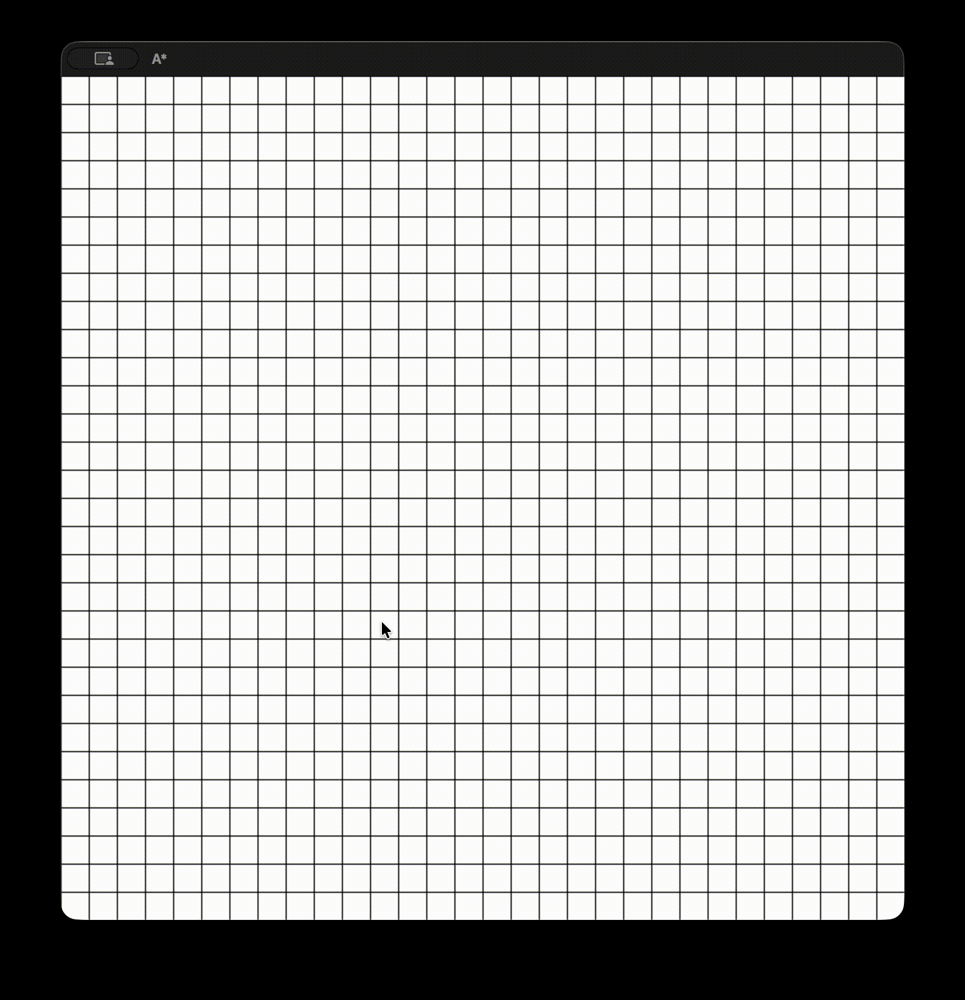

# A\* Visualizer

An interactive A\* pathfinding visualizer built with Pygame.
Place a start node, an end node, walls, then run the algorithm and watch the search animation. Can be modified to work with any algorithm.



## Installation & Run

```bash
git clone https://github.com/Dawidu7/a-star-visualizer
cd a-star-visualizer
pip install -r requirements.txt
python main.py
```

## Controls

### Mouse:

- **Left click:**
  1. Set Start
  2. Set End
  3. Set Walls
- **Right click** - Remove tiles

### Keyboard:

- **Space** - Start/Replay animation
- **C** - Clear grid
